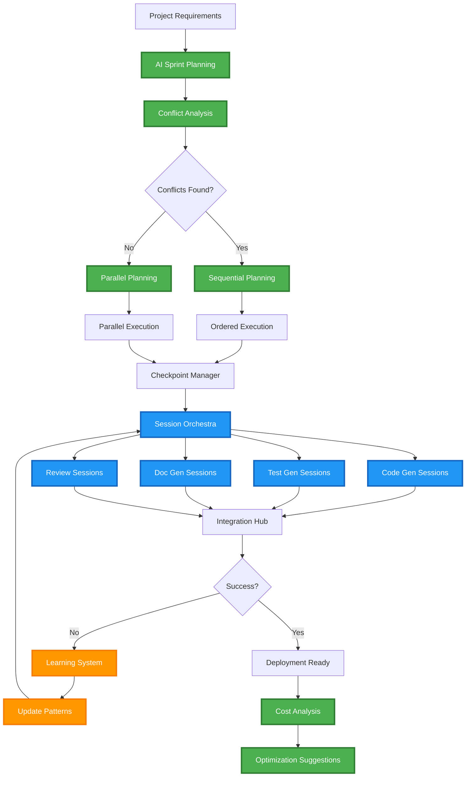

# MCP Claude Hub - Future Development Roadmap

This document outlines the ambitious future development plans for the MCP Claude Hub platform, showcasing how this hackathon project can evolve into a revolutionary AI-powered development ecosystem.

---

## 🚀 High Priority Enhancements

### Issue #101: Implement Intelligent Conflict Prevention System
**Labels:** `enhancement` `ai-orchestration` `priority-high`

#### Overview
Implement a smart work distribution system that analyzes potential file conflicts before creating parallel sessions, similar to how human dev teams plan sprints to avoid developers working on the same files.

#### Problem Statement
Currently, parallel Claude sessions may unknowingly modify the same files, leading to merge conflicts that require additional resolution sessions. This reduces efficiency and can introduce bugs.

#### Proposed Solution
Create a conflict prediction and prevention system that:
- Analyzes task requirements to predict which files will be modified
- Builds a conflict graph showing task overlaps
- Schedules sessions to minimize conflicts
- Runs conflicting tasks sequentially when necessary

#### Implementation Details
```python
class SmartWorkDistributor:
    async def analyze_potential_conflicts(self, tasks: List[Task]) -> WorkPlan:
        # Predict file impacts for each task
        # Build conflict graph
        # Create optimal execution schedule
```

#### Benefits
- 80% reduction in merge conflicts
- Faster overall completion time
- Better code quality
- More predictable timelines

#### Acceptance Criteria
- [ ] System can predict file modifications with 85%+ accuracy
- [ ] Conflict detection runs in <30 seconds for typical projects
- [ ] Scheduler produces optimal parallel/sequential mix
- [ ] Integration with existing orchestration engine

---

### Issue #102: Add Workflow Resume and Checkpoint System
**Labels:** `enhancement` `reliability` `priority-high`

#### Overview
Implement a checkpoint and resume system that allows orchestrations to recover from failures and resume from the last successful state.

#### Problem Statement
If an orchestration fails partway through (network issues, API limits, etc.), currently we must restart from the beginning, wasting time and resources.

#### Proposed Solution
```python
class CheckpointManager:
    async def save_checkpoint(self, workflow_id: str, state: WorkflowState):
        # Save current state of all sessions
        # Track completed tasks
        # Store intermediate outputs
    
    async def resume_from_checkpoint(self, workflow_id: str):
        # Restore workflow state
        # Skip completed tasks
        # Resume in-progress sessions
```

#### Benefits
- Resilience to transient failures
- Cost savings from not re-running completed work
- Ability to pause/resume long-running workflows
- Better debugging capabilities

#### Acceptance Criteria
- [ ] Checkpoints saved after each major workflow stage
- [ ] Resume completes successfully 95%+ of the time
- [ ] No duplicate work performed on resume
- [ ] Checkpoint data persisted reliably

---

### Issue #103: Implement Speculative Execution for Faster Workflows
**Labels:** `enhancement` `performance` `experimental`

#### Overview
Add speculative execution capabilities where the system predicts likely outcomes and pre-starts probable next steps.

#### Example Scenario
```
If Feature A build is 90% likely to pass CI:
  → Speculatively start Feature B (depends on A)
  → If A fails, cancel B
  → If A passes, B has a head start
```

#### Benefits
- 30-40% reduction in total workflow time
- Better resource utilization
- Smarter pipeline optimization

---

## 🤖 AI Enhancement Features

### Issue #104: Create AI Sprint Planning Assistant
**Labels:** `enhancement` `ai-orchestration` `game-changer`

#### Overview
Build an AI-powered sprint planning system that automatically decomposes projects and creates optimal work plans.

#### Features
- Automatic task decomposition
- Dependency analysis
- Effort estimation
- Resource allocation
- Risk identification

#### Example Usage
```
Input: "Build a real-time chat application with user authentication"

Output:
Sprint 1:
- Core auth system (3 sessions, parallel)
- Database schema (1 session)
- Basic UI scaffold (2 sessions, parallel)

Sprint 2:
- WebSocket implementation (2 sessions)
- Message persistence (1 session)
- UI real-time features (2 sessions)
```

---

### Issue #105: Implement Cross-Session Communication Protocol
**Labels:** `enhancement` `architecture` `priority-medium`

#### Overview
Allow Claude sessions to communicate and coordinate directly with each other during execution.

#### Use Cases
- Session A: "I'm modifying the User model"
- Session B: "Thanks, I'll wait before touching user-related files"
- Session C: "Can you expose a new method I need?"

#### Benefits
- Real-time conflict avoidance
- Better integration between components
- More human-like collaboration

---

### Issue #106: Add Learning and Pattern Recognition System
**Labels:** `enhancement` `ml` `long-term`

#### Overview
Implement a system that learns from successful/failed orchestrations to improve future performance.

#### Features
```python
class OrchestrationLearning:
    def record_success_pattern(self, workflow, outcome):
        # What worked well?
        # Which prompts were effective?
        # What was the optimal session order?
    
    def record_failure_pattern(self, workflow, error):
        # What went wrong?
        # How to avoid in future?
        # Better error handling strategies?
```

#### Benefits
- Continuously improving success rates
- Better prompt engineering over time
- Automatic optimization of workflows

---

## 🎨 User Experience Enhancements

### Issue #107: Create Visual Workflow Designer
**Labels:** `enhancement` `ui/ux` `priority-medium`

#### Overview
Build a drag-and-drop interface for designing complex orchestration workflows.

#### Features
- Visual workflow builder
- Pre-built templates
- Real-time validation
- Export to orchestration config
- Live execution monitoring

#### Mockup
```
[Start] → [Analyze] → [Parallel Tasks] → [Merge] → [Test] → [Deploy]
             ↓
        [Dependency Graph]
```

---

## 🌐 Platform Features

### Issue #108: Implement Multi-Model Orchestration
**Labels:** `enhancement` `experimental` `future`

#### Overview
Allow orchestration of different AI models for specialized tasks.

#### Example
```yaml
orchestration:
  code_generation: claude-3-opus
  code_review: claude-3-sonnet  
  documentation: claude-3-haiku
  image_generation: dall-e-3
  testing: specialized-test-model
```

#### Benefits
- Cost optimization (use cheaper models where possible)
- Specialized models for specific tasks
- Redundancy and fallback options

---

### Issue #109: Add Orchestration Marketplace
**Labels:** `enhancement` `platform` `monetization`

#### Overview
Create a marketplace where users can share and monetize their orchestration templates.

#### Features
- Upload orchestration templates
- Browse and search templates
- One-click deploy
- Rating and reviews
- Revenue sharing for creators

#### Example Templates
- "Full Stack SaaS Starter"
- "Microservices Builder"
- "React Native App Generator"
- "API Documentation Suite"

---

### Issue #110: Implement Cost Optimization Engine
**Labels:** `enhancement` `cost-savings` `priority-high`

#### Overview
Add intelligent cost optimization that minimizes API usage while maintaining quality.

#### Features
- Predict token usage before execution
- Suggest optimizations
- Use caching where possible
- Batch similar operations
- Choose optimal model for each task

#### Example Savings
```
Original: 500K tokens ($25)
Optimized: 200K tokens ($10)
Savings: 60% reduction
```

---

## 📊 Advanced Orchestration Workflow



---

## 🎯 Implementation Timeline

### Phase 1: Foundation (Months 1-2)
- Checkpoint/Resume System
- Basic Conflict Detection
- Cost Tracking

### Phase 2: Intelligence (Months 3-4)
- AI Sprint Planning
- Learning System
- Cross-Session Communication

### Phase 3: Scale (Months 5-6)
- Visual Designer
- Multi-Model Support
- Marketplace Beta

### Phase 4: Platform (Months 7-12)
- Full Marketplace Launch
- Enterprise Features
- Advanced Optimizations

---

## 💡 The Vision

MCP Claude Hub evolves from a hackathon project into **"Claude Anywhere"** - a universal AI development platform that:

1. **Automates entire development workflows** from issue to deployment
2. **Learns and improves** with every project
3. **Scales infinitely** with parallel AI sessions
4. **Integrates everywhere** (GitHub, Slack, IDEs, etc.)
5. **Reduces development time by 10x** while improving quality

This isn't just the future of AI-assisted development - it's the future of software development itself.

---

*"Give every developer an AI team that never sleeps, never forgets, and gets smarter every day."*